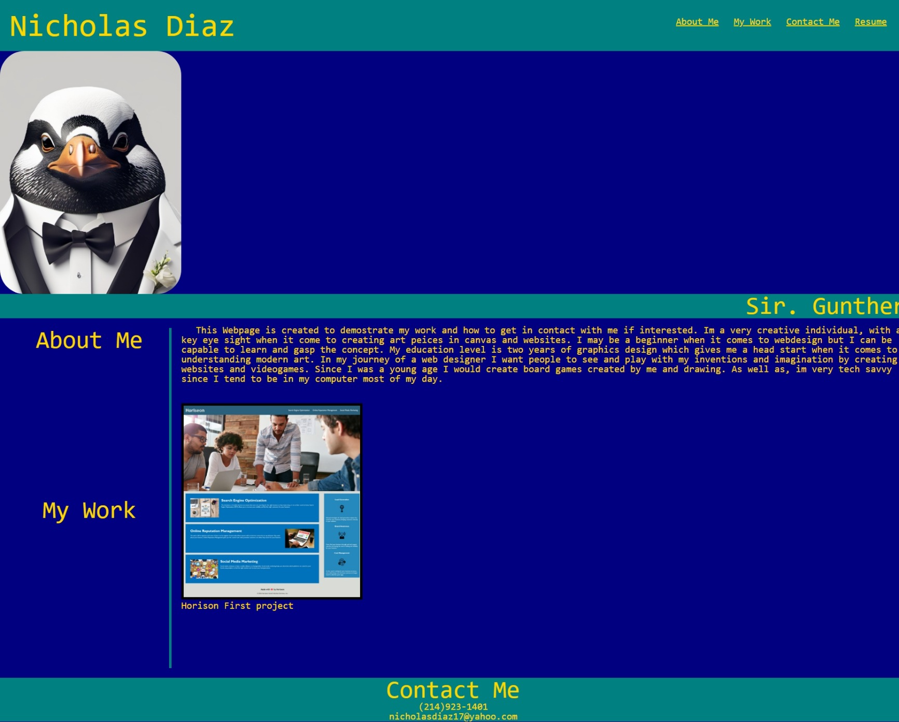

# Get-to-know-me

## Description

My Webpage is an inside perspective of my creative mind. I was able to show the colors that contrast with each other instead of regular colors seen in other webpages. I created this webpage to be able to show who i'm and show some of the work I have been working on. This webpage is bearly the beginning of my web design career. by creating this simplistic web page I was able to comprehend the functions of CSS style sheet.

## Table of Contents (Optional)

N/A

## Installation

My Url will be located in my GitHub account and leads to my repository. As well as, by clicking on this READ ME url.

## Usage

## Credits

Thank you to W3School for providing codes which helped with positioning my content in the correct order.

W3School Url: https://www.w3schools.com/

## License

The last section of a high-quality README file is the license. This lets other developers know what they can and cannot do with your project. If you need help choosing a license, refer to [https://choosealicense.com/](https://choosealicense.com/).

---

🏆 The previous sections are the bare minimum, and your project will ultimately determine the content of this document. You might also want to consider adding the following sections.

## Badges

N/A

## Features

N/A

## How to Contribute

N/A

## Tests

N/A